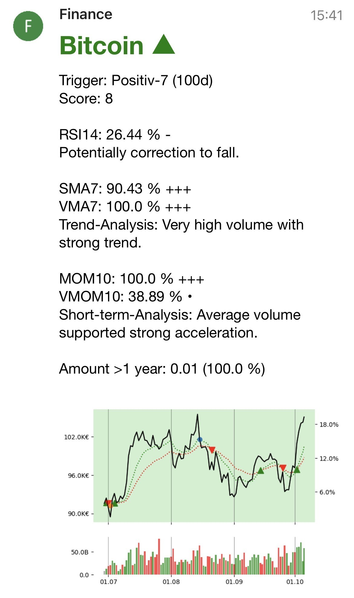

# Crypto and Stock Alert

## Overview

This project provides a Python-based system for analyzing and monitoring cryptocurrencies and stocks. It uses technical indicators like Moving Averages, RSI, Momentum, and Volume Analysis to evaluate trends and alert users on significant market conditions. The system tracks and visualizes data, calculates profits, and sends notifications using Pushover.

## Why do I need CaSa?

I've always wanted to invest in stocks and cryptocurrencies, but I was held back by the fear of missing rapid market changes and, especially with crypto, the risk of losing significant money. Constantly monitoring prices felt overwhelming and stressful.

Moreover, I was never fully satisfied with the existing apps and their features for tracking price changes. Most of them offer only basic alert thresholds, while more advanced functionalities often come with a price tag.

That's why I decided to take matters into my own hands and developed CaSa—a free, open-source program now available on GitHub. CaSa is reliable and already includes several essential features, making it an excellent starting point for anyone facing the same challenges I did.

While it's functional and stable, there's still plenty of room for growth. Check out the "New Feature Idea List" for planned improvements and let's build something great together!


## Features

- **Automatic Data Retrieval**: Fetches crypto data from CoinGecko and stock data from Yahoo Finance
- **Advanced Technical Analysis**: Multi-indicator scoring system combining:
  - **RSI14**: 14-day Relative Strength Index for overbought/oversold signals
  - **MOM10 & VMOM10**: Price and volume momentum with fake-out detection
  - **SMA7 & VMA7**: Short-term trend and volume analysis with fake-out detection
  - **EMA Crossovers**: Fast/Slow EMA buy/sell signals
  - **7-Day Slope Analysis**: Price trend strength over weekly periods
- **Smart Alarm System**: 
  - Quantile-based signal strength (3 levels: +/-, ++/--, +++/---)
  - Volume-supported momentum detection
  - Duplicate alarm filtering with configurable thresholds
- **Visual Analytics**: Automated chart generation with price, EMA, volume bars, and buy/sell signals
- **Portfolio Tracking**: Monitors holdings with profit calculations and tax-relevant holding periods (>1 year)
- **Watch-List**: Track potential investments without ownership
- **Scheduling**: Configurable hourly (100h) and daily (100d) analyses
- **Daily Summaries**: Rating-sorted overview tables sent via Pushover

## What's New

- **Enhanced Technical Analysis**: Multi-layered scoring system combining RSI, momentum, and volume indicators
- **Volume Analysis**: Volume momentum (VMOM10) and volume moving average (VMA7) with fake-out detection
- **Improved Charts**: Added volume bars color-coded by price direction (green/red)
- **Smarter Alarms**: Quantile-based signal classification with arrow indicators (+/-, ++/--, +++/---)
- **Better Error Handling**: Exponential backoff for API rate limits and improved retry logic
- **Modular Design**: Separated technical analysis functions for easier customization

## Project Structure

- `classes.py`: Contains the `crypto_stock` class for managing individual assets, transactions, and alarm data
- `func.py`: Utility functions for data retrieval, indicator calculations, alarm handling, and visualization
- `main.py`: Main orchestration script for scheduling, analysis, and notifications
- `config.ini`: Configuration file for crypto/stock lists, alert limits, and API keys (must be created manually)

## Installation

1. Install Python 3
2. Install Dependencies: `pip3 install pandas numpy yfinance scipy matplotlib plotly schedule requests pytrends configparser`
3. Create `config.ini` in the root directory (see **Configuration File** section)
4. Run the script: `python3 main.py`

**Note**: Tested on RockPi3 with Armbian OS, initiated via SSH with mapped folder for `config.ini` editing.

## Understanding the Alerts

**Alert Components:**
- **Score**: Combined indicator rating (higher = stronger buy signal)
- **RSI14**: Shows quantile percentage with signal arrows (+/-, ++/--, +++/---)
- **MOM10 & VMOM10**: Price and volume momentum with fake-out warnings
- **SMA7 & VMA7**: Short-term trend and volume strength with fake-out warnings
- **Trigger**: Specific condition that generated the alert (e.g., Cross-EMA, 100-Minimum)
- **Amount >1 year**: Holdings older than one year (tax-relevant in some countries)

**Signal Strength:**
- `+++` / `---`: Very strong signal (top/bottom 10% quantile)
- `++` / `--`: Strong signal (10-20% quantile)
- `+` / `-`: Moderate signal (20-30% quantile)
- `•`: Neutral (30-70% quantile)

**Fake-Out Detection**: Warns when price movement lacks volume support



## Configuration File (config.ini)

```ini
[version]
number = 1.2.0

[pushover]
token = YOUR_PUSHOVER_TOKEN
user = YOUR_PUSHOVER_USER_KEY

[alarm]
one_day_price_change = 10       # One-day price change threshold (%)
seven_day_price_change = 7      # Seven-day price change threshold (%)
previous_alarm_change = 3       # Minimum change between consecutive alarms (%)
one_day_profit_limit = -2       # One-day profitability threshold (%) - currently inactive
test_mode = 0                   # 0 = production, 1 = test mode

[crypto]
bitcoin = Bitcoin; 1000,0.05,01/01/2022; 1000,0.05,02/01/2022   # Portfolio: [CoinGecko ID] = [Name]; [EUR],[Amount],[DD/MM/YYYY]
matic-network = Polygon; 1,1,1                                   # Watch-list: Use 1,1,1 for tracking only

[stocks]
APC.DE = Apple; 1000,10,01/01/2022       # Portfolio: [Yahoo Symbol] = [Name]; [EUR],[Shares],[DD/MM/YYYY]
LHA.DE = Lufthansa; 1,1,1                # Watch-list: Use 1,1,1 for tracking only
```

**Note**: Currently supports Euro-denominated stocks only (e.g., APC.DE, AMZ.DE).

## Dependencies

- **Python Libraries**: `pandas`, `numpy`, `yfinance`, `scipy`, `matplotlib`, `plotly`, `schedule`, `requests`, `pytrends`, `configparser`
- **External APIs**: Pushover (free account), CoinGecko, Yahoo Finance

## License

This project is licensed under the MIT License.

## Disclaimer

This application generates alerts based on technical indicators and market data analysis. All alerts are purely informational and require independent user evaluation. Users are solely responsible for their own investment decisions. CaSa does not recommend buying or selling any assets, nor does it provide personalized investment advice.

## Links

- [Pushover](https://pushover.net/) — Notification service (iOS/Android apps available)
- [CoinGecko](https://www.coingecko.com) — Cryptocurrency market data
- [Yahoo Finance](https://finance.yahoo.com) — Stock market data
- [Rock Pi](https://rockpi.org/) — Single-board computer for hosting
- [Armbian OS](https://www.armbian.com/) — Lightweight ARM-based OS